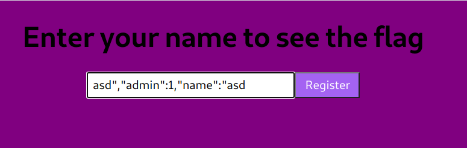
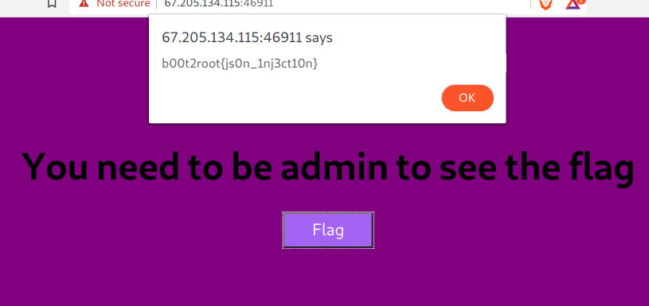

# Write up

The idea of this challenge is to register with a name such that we can override tha value of the `admin` key of the json. We can focus our attention on this line:
```
var token = `{"admin":0,"name":"${name}"}`
```

We certainly would like to do something like: 

```var token = `{"admin":0,"name":"asd","admin":1,"name":"asd"}```

This way, the admin property will be overriden. So let's try it.
Because we have "${name}", we already have the first and last `"`. So we can craft this name:
```
asd","admin":1,"name":"asd
```

Register with this user





```
b00t2root{js0n_1nj3ct10n}
```